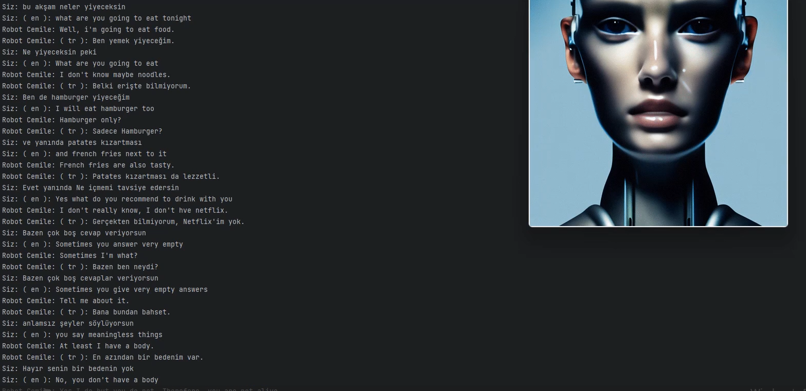

# Robot Cemile - Sesli Asistan

Robot Cemile, söylediklerinize yapay zeka desteği ile cevap veren bir uygulamadır. Kullanıcılar, bu uygulama ile istedikleri dillerde pratik yapabilir , öğrenmek istediği soruları sorabilir ve sohbet edebilirler.
## Özellikler

- Sesli komutlarla metin çevirisi yapabilme.
- Kullanıcıya sesli cevap verme yeteneği.

## Nasıl Kullanılır

1. Uygulamayı başlatın.
2. "Robot Cemile hazır lütfen konuşmaya başlayın." mesajını bekleyin.
3. İstediğiniz bir komutu sesli olarak söyleyin.
4. Cemile size yanıt verecektir.


## Ekran Görüntüsü




## Bağımlılıklar

Bu uygulama aşağıdaki Python kütüphanelerine ihtiyaç duyar:

- `cleverbotfree` (Cleverbot ile iletişim kurmak için)
- `googletrans` (Metin çevirisi için)
- `gtts` (Metinleri sesli olarak okumak için)
- `playsound` (Ses dosyalarını çalmak için)
- `speech_recognition` (Ses tanıma için)
- `tkinter` (Grafik arayüz oluşturmak için)
- `PIL` (Pillow) (Görüntü işleme için)

## Detaylı bilgi için web sitemi ziyaret edin.
Daha fazla bilgi için [web sitemi ziyaret edin](https://ayazaktas.netlify.app).


Gerekli bağımlılıkları kurmak için aşağıdaki komutları kullanabilirsiniz:

```bash
pip install cleverbotfree googletrans==4.0.0-beta1 gTTS playsound SpeechRecognition pillow
